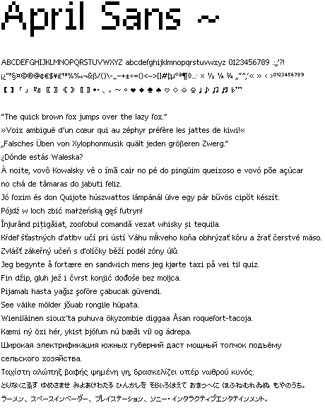

# April Sans - Pixel Font

 

The **April Sans** is a free and simple pixel font which supports a variety of languages. The main focus is readability and supporting as many languages as possible. It currently features over 600+ glyphs. Created with the wonderful [BitFontMaker2](https://www.pentacom.jp/pentacom/bitfontmaker2/#) and improved in Glyphs 2.

**Supported Languages:** English, German, French, Italian, Spanish, Portuguese, Polish, Slovak, Romanian, Serbian, Swedish, Turkish, Norwegian, Finnish and Japanese (Hiragana & Katakana, no Kanji).

---

